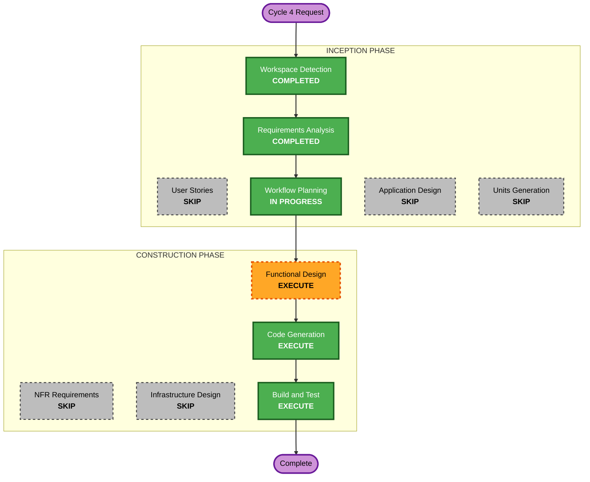

# Cycle 4 Execution Plan — Installment Expenses

## Detailed Analysis Summary

### Transformation Scope (Brownfield)
- **Transformation Type**: Single-unit feature addition within existing layered architecture
- **Primary Changes**: New `InstallmentPlans` table + `installmentPlanId` link column on `Transactions`; plan generation/deletion logic; installment entry UI; badges in transaction list
- **Related Components**: domain (entity + calculator + repo interface), data (Drift schema v bump + migration, repo impl, backup v2), application (provider + controller wiring), presentation (transaction edit screen, list widgets), l10n (EN+TH strings)

### Change Impact Assessment
- **User-facing changes**: Yes — installment option in expense entry, plan badges "k/N", plan view/delete
- **Structural changes**: No — follows existing domain/data/application/presentation layering
- **Data model changes**: Yes — new table, new FK column, `schemaVersion` bump + migration, backup JSON `version: 2`
- **API changes**: No external API (offline-first, no backend)
- **NFR impact**: No new NFRs — existing money/atomicity/i18n/multi-platform invariants apply

### Risk Assessment
- **Risk Level**: Medium — schema migration + backup format change on 3 platforms
- **Rollback Complexity**: Easy (git revert; migration additive-only)
- **Testing Complexity**: Moderate — split/rounding/date-clamp unit tests, plan CRUD tests, backup round-trip test

## Workflow Visualization



### Text Alternative
```
INCEPTION:    Workspace Detection (done) -> Requirements Analysis (done)
              -> Workflow Planning (this doc)
              User Stories, Application Design, Units Generation: SKIP
CONSTRUCTION: Functional Design (EXECUTE) -> Code Generation (EXECUTE)
              -> Build and Test (EXECUTE)
              NFR Requirements/Design, Infrastructure Design: SKIP
```

## Phases to Execute

### INCEPTION PHASE
- [x] Workspace Detection (COMPLETED)
- [x] Requirements Analysis (COMPLETED — installment-requirements.md)
- [x] User Stories - SKIP
  - **Rationale**: Single persona, requirements + decisions table already capture acceptance behavior
- [x] Workflow Planning (this document)
- [ ] Application Design - SKIP
  - **Rationale**: No new architectural components — new classes slot into existing layers per established Cycle 1 patterns (entity/repo/controller/screen)
- [ ] Units Generation - SKIP
  - **Rationale**: Single unit `money-manager`

### CONSTRUCTION PHASE (unit: money-manager)
- [ ] Functional Design - EXECUTE
  - **Rationale**: New data model (InstallmentPlans + FK), split/rounding/date-clamp algorithm, new business rules (BR codes), backup v2 shape — worth designing before code
- [ ] NFR Requirements - SKIP
  - **Rationale**: Tech stack fixed, no new NFRs
- [ ] NFR Design - SKIP
  - **Rationale**: NFR Requirements skipped
- [ ] Infrastructure Design - SKIP
  - **Rationale**: Offline-first app, no infrastructure
- [ ] Code Generation - EXECUTE (ALWAYS)
- [ ] Build and Test - EXECUTE (ALWAYS)

## Success Criteria
- **Primary Goal**: User records expense payable over 3/6/10/12 months; app generates linked monthly installments
- **Key Deliverables**:
  - Schema v+1 with `InstallmentPlans` + `Transactions.installmentPlanId`, migration
  - Split algorithm (even split, remainder to last, date clamp) in `domain/services`
  - Plan create/delete controller ops (atomic), edit/delete guard on linked transactions
  - UI: installment toggle + preset picker in expense form, "k/N" badge in lists, plan management
  - Backup JSON v2 including plans, restore handles v1
  - EN+TH localization; `flutter analyze` clean; all tests pass; web build OK
- **Quality Gates**: Unit tests for split/rounding/date edge cases (31-day months, Feb), plan CRUD atomicity test, backup round-trip test
