# Execution Plan — Money Manager App

## Detailed Analysis Summary

### Change Impact Assessment
- **User-facing changes**: Yes — entire app UI (transactions, budgets, reports, settings).
- **Structural changes**: Yes — new greenfield architecture (layered: data/domain/presentation).
- **Data model changes**: Yes — Transaction, Category, Budget, Wallet entities + local DB schema.
- **API changes**: No external API. Internal repository interfaces only.
- **NFR impact**: Low — local-only app, no perf/scale/infra concerns; tech stack pre-decided.

### Risk Assessment
- **Risk Level**: Low
- **Rollback Complexity**: Easy (greenfield, local app, versionable)
- **Testing Complexity**: Moderate (money math + budget logic unit tests)

## Workflow Visualization

```mermaid
flowchart TD
    Start(["User Request"])

    subgraph INCEPTION["INCEPTION PHASE"]
        WD["Workspace Detection<br/><b>COMPLETED</b>"]
        RA["Requirements Analysis<br/><b>COMPLETED</b>"]
        US["User Stories<br/><b>SKIP</b>"]
        WP["Workflow Planning<br/><b>COMPLETED</b>"]
        AD["Application Design<br/><b>EXECUTE</b>"]
        UG["Units Generation<br/><b>SKIP</b>"]
    end

    subgraph CONSTRUCTION["CONSTRUCTION PHASE"]
        FD["Functional Design<br/><b>EXECUTE</b>"]
        NFRA["NFR Requirements<br/><b>SKIP</b>"]
        NFRD["NFR Design<br/><b>SKIP</b>"]
        ID["Infrastructure Design<br/><b>SKIP</b>"]
        CG["Code Generation<br/><b>EXECUTE</b>"]
        BT["Build and Test<br/><b>EXECUTE</b>"]
    end

    subgraph OPERATIONS["OPERATIONS PHASE"]
        OPS["Operations<br/><b>PLACEHOLDER</b>"]
    end

    Start --> WD
    WD --> RA
    RA --> US
    US --> WP
    WP --> AD
    AD --> UG
    UG --> FD
    FD --> NFRA
    NFRA --> NFRD
    NFRD --> ID
    ID --> CG
    CG --> BT
    BT --> OPS
    OPS --> End(["Complete"])

    style WD fill:#4CAF50,stroke:#1B5E20,stroke-width:3px,color:#fff
    style RA fill:#4CAF50,stroke:#1B5E20,stroke-width:3px,color:#fff
    style WP fill:#4CAF50,stroke:#1B5E20,stroke-width:3px,color:#fff
    style AD fill:#FFA726,stroke:#E65100,stroke-width:3px,stroke-dasharray: 5 5,color:#000
    style FD fill:#FFA726,stroke:#E65100,stroke-width:3px,stroke-dasharray: 5 5,color:#000
    style CG fill:#4CAF50,stroke:#1B5E20,stroke-width:3px,color:#fff
    style BT fill:#4CAF50,stroke:#1B5E20,stroke-width:3px,color:#fff
    style US fill:#BDBDBD,stroke:#424242,stroke-width:2px,stroke-dasharray: 5 5,color:#000
    style UG fill:#BDBDBD,stroke:#424242,stroke-width:2px,stroke-dasharray: 5 5,color:#000
    style NFRA fill:#BDBDBD,stroke:#424242,stroke-width:2px,stroke-dasharray: 5 5,color:#000
    style NFRD fill:#BDBDBD,stroke:#424242,stroke-width:2px,stroke-dasharray: 5 5,color:#000
    style ID fill:#BDBDBD,stroke:#424242,stroke-width:2px,stroke-dasharray: 5 5,color:#000
    style OPS fill:#BDBDBD,stroke:#424242,stroke-width:2px,stroke-dasharray: 5 5,color:#000
    style Start fill:#CE93D8,stroke:#6A1B9A,stroke-width:3px,color:#000
    style End fill:#CE93D8,stroke:#6A1B9A,stroke-width:3px,color:#000

    linkStyle default stroke:#333,stroke-width:2px
```

## Phases to Execute

### INCEPTION PHASE
- [x] Workspace Detection (COMPLETED)
- [x] Requirements Analysis (COMPLETED)
- [x] User Stories (SKIPPED)
- [x] Workflow Planning (IN PROGRESS)
- [ ] Application Design — **EXECUTE**
  - **Rationale**: New greenfield app; needs component map, layer boundaries, repository interfaces, provider/service design.
- [ ] Units Generation — **SKIP**
  - **Rationale**: Single cohesive Flutter module. No multi-package decomposition needed. Whole app treated as one unit: `money-manager`.

### CONSTRUCTION PHASE (unit: money-manager)
- [ ] Functional Design — **EXECUTE**
  - **Rationale**: Data models (Transaction/Category/Budget/Wallet), DB schema, budget calc + integer money math business rules.
- [ ] NFR Requirements — **SKIP**
  - **Rationale**: Tech stack pre-decided (Flutter/Drift/Riverpod/Material3). No perf/scale/security NFRs beyond those captured; all extensions OFF.
- [ ] NFR Design — **SKIP**
  - **Rationale**: NFR Requirements skipped.
- [ ] Infrastructure Design — **SKIP**
  - **Rationale**: Local-only mobile app. No cloud/infra/deployment resources.
- [ ] Code Generation — **EXECUTE (ALWAYS)**
  - **Rationale**: Generate the Flutter app code + tests.
- [ ] Build and Test — **EXECUTE (ALWAYS)**
  - **Rationale**: Build both platforms, run unit/widget tests.

### OPERATIONS PHASE
- [ ] Operations — PLACEHOLDER

## Estimated Timeline
- **Total Stages to Execute**: 4 (Application Design, Functional Design, Code Generation, Build & Test)
- **Estimated Duration**: Short — single unit MVP.

## Success Criteria
- **Primary Goal**: Working offline-first Flutter money manager MVP (Android + iOS).
- **Key Deliverables**: Running app — log/categorize/budget/report transactions, app lock, theming; unit tests for money & budget logic.
- **Quality Gates**: `flutter analyze` clean, unit + widget tests pass, app builds and launches.
